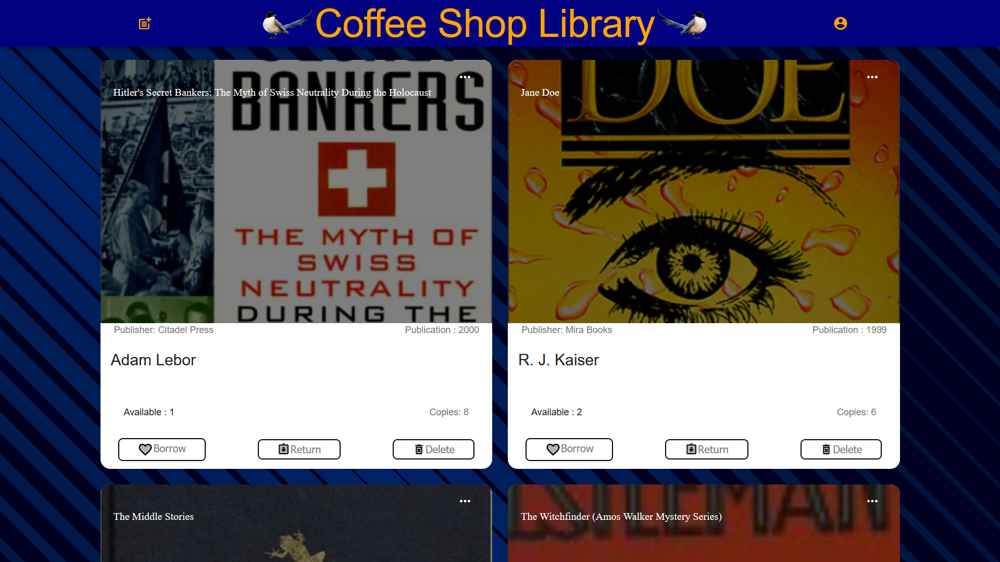

<h1 align="center">Welcome to books-webapp 👋</h1>
<p>
  
  <a href="https://github.com/obyat/books-webapp" target="_blank">
    
  </a>
  <a href="#" target="_blank">
    
  </a>
</p>

> Books Web App

### 🏠 [Homepage](https://github.com/obyat/books-webapp)

### ✨ [Demo](https://birdbook.netlify.app/)

## About

A <a href="https://www.hackdiversity.com/">Hack.Diversity</a>  mini-project that utilizations a **MERN Stack development environment** to create a web application that allows coffee shop customers to loan and return books. 

**Requirements of the project** view <a href="https://github.com/obyat/books-webapp/blob/main/Hack.Diversity%20de.Hackathon%20-%20Mini%20Project%20(2021).pdf
">page 3</a> for more details.
* Have a web page that allows customers to view a list of currently available books and allows them to borrow and return books
* Allow coffee shop employees to add new books and edit the book stock amount
* Add details page such as an image and book listing

### Project Overview
#### Back-end

* MongoDB persists the data
* Mongoose streamlines database interactions

#### Front-end

* React displays the front end with ```axios``` to connect it to the back-end

## Installation & Usage

clone this repositiry
```sh
git clone https://github.com/obyat/books-webapp/.git.
```

In the **client** directory
```sh
npm install 
```

cd into **client** directory and enter the command:

```sh
npm start
```

Then cd into **server** directory and enter the command:

```sh
npm start
```
Go to **http://localhost:3000**

<!-- cd into client directory and enter the command npm start. Then cd into server directory and enter npm start. Then see in the browser. --->

Client side output
```Server Running on Port: http://localhost:3000```

Server side output
```Server Running on Port: http://localhost:5000```

## Authors

👤 **Obyat Abdelrahman, Olubiyi Ojo, Dakotah Scalzi, Eliana Lopez, and Myriam Iralien** 👤

* Website: https://www.linkedin.com/in/obyat
* Github: [@Obyat](https://github.com/Obyat)
* LinkedIn: [@Abdelrahman Obyat](https://linkedin.com/in/Abdelrahman Obyat)

* **Olubiyi Ojo** |  <a href="https://github.com/21ojoo">GitHub</a> 
* **Dakotah Scalzi** |  <a href="https://github.com/TheOnlyFreshPrince">GitHub</a> 
* **Adalberto Souza** |  <a href="https://github.com/adalberto1254">GitHub</a> 
* **Eliana Lopez** |  <a href="https://github.com/elianalopez">GitHub</a> 
* **Myriam Iralien** |  <a href="https://github.com/myriamiralien">GitHub</a> 

## Images


<p align="center">image of the website demo</p>

<p align="center"></p>

<p align="center">Book Schema</p>


## Show your support

Give a ⭐️ if this project helped you!

***
_This README was generated with ❤️ by [readme-md-generator](https://github.com/kefranabg/readme-md-generator)_
